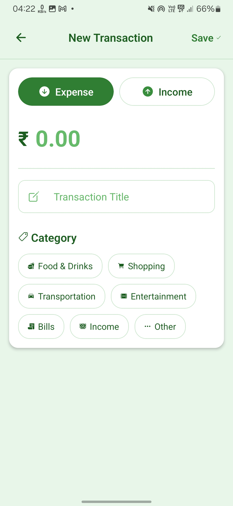
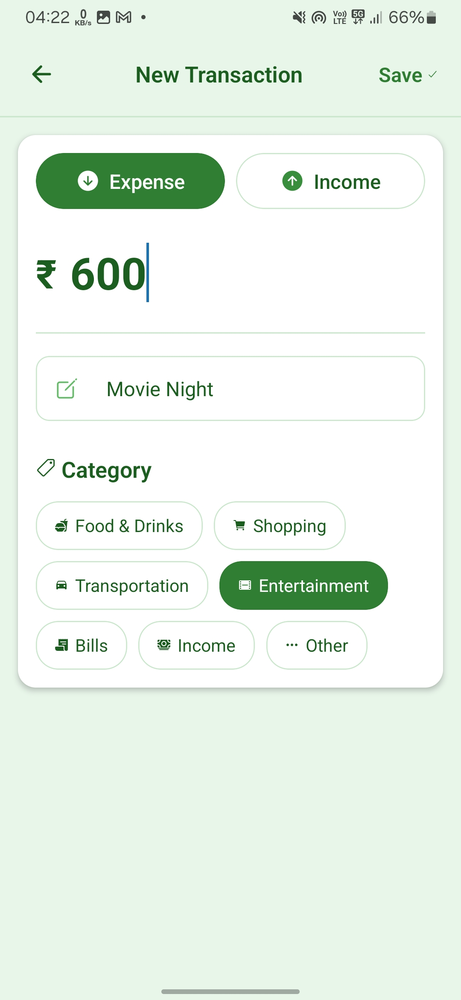
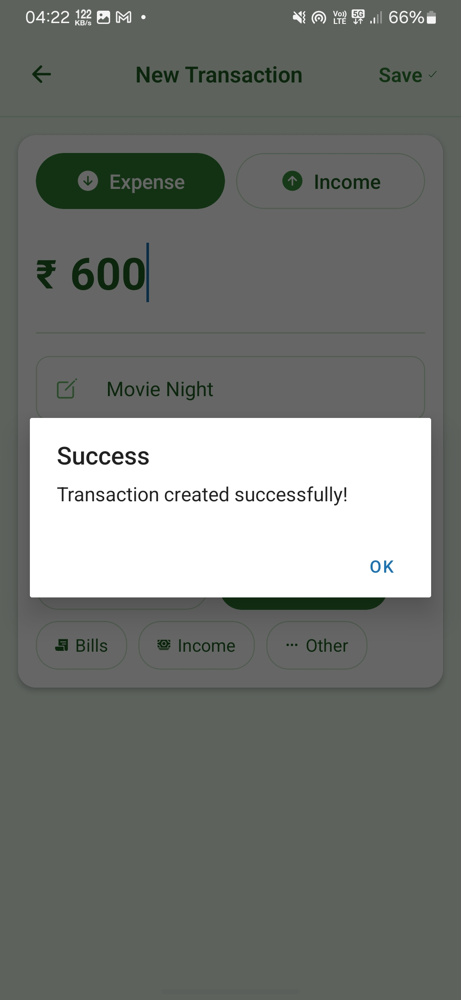

# 💰 Paysa - Expense Tracker App

A cross-platform **Expense Tracker** mobile app built using **React Native (frontend)** and **Hono + Cloudflare Workers (backend)**. This is a simplified version of a future visioned product idea, _“Paysa,”_ designed to help users track their daily expenses with ease.

## 📱 Features

- User Authentication (JWT-based login/signup)
- Add, view, and delete expenses
- View total expenses summary
- Fully responsive UI
- Built for real devices (Android/iOS)

## 🛠️ Tech Stack

### Frontend (Mobile)

- React Native (via Expo)
- React Native Stack Navigation
- Clerk Authentication
- StyleSheet for styling

### Backend

- Hono (Fast JavaScript Web Framework)
- Cloudflare Workers
- TiDB hosted MySQL database
- Rate Limiting (Upstash Redis)

## 📂 Folder Structure

```
expense-tracker-rn-hono/
├── backend/               # Hono backend API (Cloudflare Worker)
│   ├── routes/
│   ├── middleware/
│   ├── db/
│   └── index.ts
│
├── mobile/                # React Native app
│   ├── src/
│   │   ├── screens/
│   │   ├── components/
│   │   ├── context/
│   │   ├── services/
│   │   └── utils/
│   └── App.tsx
└── README.md
```

## 🚀 Getting Started

### 1. Clone the Repo

```bash
git clone https://github.com/khalkaryash/expense-tracker-rn-hono.git
cd expense-tracker-rn-hono
```

### 2. Backend Setup

```bash
cd backend
npm install
```

#### For local dev:

```bash
npx wrangler dev
```

#### For production deploy:

```bash
npx wrangler publish
```

### 3. Mobile Setup

```bash
cd mobile
yarn install
```

#### Start Expo server:

```bash
npx expo start
```

> 🔐 **Don't forget to add values for all the variables in your backend and mobile in `.env`!**

## 🔐 Environment Variables

### Backend

Inside `backend/.env`:

```ts
DATABASE_URL = "db url here";
UPSTASH_REDIS_REST_URL = "redis url here";
UPSTASH_REDIS_REST_TOKEN = "redis token here";
```

### Mobile

Inside `mobile/.env`:

```ts
EXPO_PUBLIC_API_URL="backend url"
EXPO_PUBLIC_CLERK_PUBLISHABLE_KEY="clerk key"
```

## ✅ API Endpoints

| Method | Endpoint                            | Description                        |
| ------ | ----------------------------------- | ---------------------------------- |
| GET    | `/api/transactions/:userId`         | Get all transactions for a user    |
| POST   | `/api/transactions`                 | Add a new transaction              |
| DELETE | `/api/transactions/:id`             | Delete a transaction by ID         |
| GET    | `/api/transactions/summary/:userId` | Get transaction summary for a user |

## 📸 Screenshots

### ▶️ Demo Video

[](./mobile/assets/images/Demo.mp4)

> _Click the image above to watch the demo video_

### 📷 App Screens

| Login                              | Signup                             | Home/Summary                       |
| ---------------------------------- | ---------------------------------- | ---------------------------------- |
|  |  |  |

| Add Transaction                    | Adding transaction details         | Transaction added confirmation     |
| ---------------------------------- | ---------------------------------- | ---------------------------------- |
|  |  |  |

## 🧑‍💻 Author

Made with ❤️ by **[Yash Khalkar](https://github.com/KhalkarYash)**

## 📜 License

**MIT**
